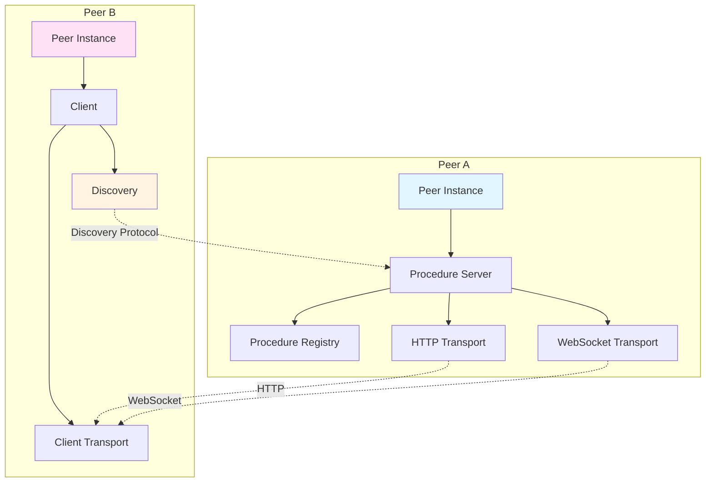
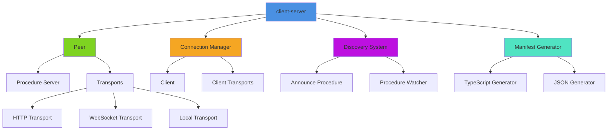

# @mark1russell7/client-server

[](https://www.npmjs.com/package/@mark1russell7/client-server)
[](https://opensource.org/licenses/MIT)
[](https://nodejs.org)

> Transport-agnostic peer for bidirectional RPC - exposes procedures and generates manifests

## Overview

`client-server` is a comprehensive server infrastructure package that enables transport-agnostic bidirectional RPC communication. It provides a peer-to-peer architecture where each peer can both expose procedures and call procedures on remote peers. The package supports multiple transport layers (HTTP, WebSocket, local) and includes automatic procedure discovery and manifest generation.

### Key Features

- **Transport-Agnostic**: Supports HTTP, WebSocket, and in-process transports
- **Bidirectional RPC**: Peers can both expose and call procedures
- **Automatic Discovery**: Peers exchange procedure manifests on connection
- **Manifest Generation**: Generate TypeScript and JSON manifests from registered procedures
- **Connection Management**: Track and manage multiple peer connections
- **Express Integration**: Optional Express.js integration for HTTP transport
- **Zero Configuration**: Auto-register all procedures from the global registry

## Architecture



### Component Hierarchy



## Installation

```bash
npm install @mark1russell7/client-server
```

Or with pnpm:

```bash
pnpm add @mark1russell7/client-server
```

### Dependencies

This package depends on:
- `@mark1russell7/client` - Core client/procedure system
- `zod` - Schema validation
- `zod-to-json-schema` - JSON schema generation
- `express` (optional) - HTTP server for HTTP transport

## Usage

### Creating a Server Peer

```typescript
import { createPeer } from "@mark1russell7/client-server";

// Create a peer with HTTP and WebSocket transports
const peer = await createPeer({
  id: "my-server",
  transports: [
    {
      type: "http",
      port: 3000,
      host: "0.0.0.0",
      basePath: "/api",
      cors: true,
    },
    {
      type: "websocket",
      port: 3001,
      host: "0.0.0.0",
      path: "/ws",
    },
  ],
  autoRegister: true, // Auto-register all procedures from global registry
});

// Start all transports
await peer.start();

// Get active endpoints
console.log(peer.getEndpoints());
// [
//   { type: "http", address: "http://localhost:3000/api" },
//   { type: "websocket", address: "ws://localhost:3001/ws" }
// ]

// Stop the peer
await peer.stop();
```

### Using Server Procedures

```typescript
import { Client } from "@mark1russell7/client";

const client = new Client(/* ... */);

// Create a server
const result = await client.call(["server", "create"], {
  transports: [
    { type: "http", port: 3000 },
    { type: "websocket", port: 3001 },
  ],
  autoRegister: true,
});

console.log(result);
// {
//   serverId: "peer-1234567890-abc123",
//   endpoints: [
//     { type: "http", address: "http://localhost:3000/api" },
//     { type: "websocket", address: "ws://localhost:3001/ws" }
//   ],
//   procedureCount: 42
// }
```

### Connecting to Remote Peers

```typescript
import { connect } from "@mark1russell7/client-server";

// Connect to a remote peer
const connection = await connect({
  address: "http://localhost:3000/api",
  transport: "http", // Auto-detected from URL if omitted
  timeout: 10000,
  localPeerId: "my-client",
});

console.log(connection.remote);
// {
//   id: "conn-1234567890-xyz789",
//   remotePeerId: "peer-1234567890-abc123",
//   transport: "http",
//   state: "connected",
//   remoteProcedures: [
//     { path: ["git", "status"], description: "Get git status" },
//     { path: ["git", "add"], description: "Stage files" },
//     // ...
//   ],
//   connectedAt: Date
// }

// Call procedures on the remote peer
const gitStatus = await connection.client.call(["git", "status"], { cwd: "/path" });

// Disconnect
await connection.disconnect();
```

### Procedure Discovery

The discovery system automatically exchanges procedure manifests when peers connect:

```typescript
import { discoveryAnnounceProcedure, getProcedureInfos, watchProcedures } from "@mark1russell7/client-server";

// Get all registered procedures
const procedures = getProcedureInfos();
console.log(procedures);
// [
//   { path: ["git", "status"], description: "Get git status" },
//   { path: ["git", "add"], description: "Stage files" },
//   // ...
// ]

// Watch for procedure changes
const unwatch = watchProcedures((event, info) => {
  console.log(`Procedure ${event}:`, info.path.join("."));
});

// Stop watching
unwatch();
```

### Manifest Generation

Generate TypeScript declarations or JSON manifests from registered procedures:

```typescript
import { generateTypeScript, generateJson, generateJsonString } from "@mark1russell7/client-server";

// Generate TypeScript declaration
const tsDeclaration = generateTypeScript({
  namespace: ["git"], // Only include git.* procedures
});

console.log(tsDeclaration);
// export interface Procedures {
//   "git.status": { input: { cwd?: string }, output: { ... } };
//   "git.add": { input: { files: string[], all?: boolean }, output: { ... } };
//   // ...
// }

// Generate JSON manifest
const manifest = generateJson({
  namespace: ["git"],
});

console.log(manifest);
// {
//   procedures: [
//     {
//       path: ["git", "status"],
//       description: "Get git status",
//       inputSchema: { ... },
//       outputSchema: { ... }
//     },
//     // ...
//   ],
//   generatedAt: "2025-01-15T10:30:00.000Z",
//   version: "1.0.0"
// }

// Generate JSON string
const jsonString = generateJsonString({ namespace: ["git"] });
```

### Using with Procedure Calls

```typescript
// Connect to remote server
await client.call(["server", "connect"], {
  address: "http://localhost:3000/api",
  transport: "http",
  timeout: 10000,
});

// Disconnect from server
await client.call(["server", "disconnect"], {
  connectionId: "conn-1234567890-xyz789",
});

// Generate manifest
const manifest = await client.call(["manifest", "generate"], {
  formats: ["json", "typescript"],
  namespace: ["git"],
  outputDir: "./generated",
});

console.log(manifest);
// {
//   json: { procedures: [...], generatedAt: "...", version: "..." },
//   typescript: "export interface Procedures { ... }",
//   filesWritten: ["./generated/manifest.json", "./generated/manifest.d.ts"]
// }
```

## API Reference

### Peer

#### `createPeer(options: PeerOptions): Promise<Peer>`

Create a new peer instance.

**Options:**
- `id: string` - Unique peer ID
- `transports: TransportConfig[]` - Transports to enable
- `autoRegister?: boolean` - Auto-register procedures from registry (default: true)
- `registry?: ProcedureRegistry` - Custom procedure registry (default: global)

**Returns:** Peer instance with methods:
- `start(): Promise<void>` - Start all transports
- `stop(): Promise<void>` - Stop all transports
- `getEndpoints(): PeerEndpoint[]` - Get active endpoints
- `getServer(): ProcedureServer` - Get underlying procedure server

#### Transport Configurations

##### HTTP Transport

```typescript
{
  type: "http",
  port?: number,        // Default: 3000
  host?: string,        // Default: "0.0.0.0"
  basePath?: string,    // Default: "/api"
  cors?: boolean,       // Default: true
  corsOrigins?: string[] // Allowed origins
}
```

##### WebSocket Transport

```typescript
{
  type: "websocket",
  port?: number,        // Default: 3001
  host?: string,        // Default: "0.0.0.0"
  path?: string         // Default: "/ws"
}
```

##### Local Transport

```typescript
{
  type: "local"         // In-process communication
}
```

### Connection

#### `connect(options: ConnectOptions): Promise<Connection>`

Connect to a remote peer.

**Options:**
- `address: string` - Remote server URL
- `transport?: TransportType` - Transport type (auto-detected from URL)
- `timeout?: number` - Connection timeout in ms
- `localPeerId?: string` - Local peer ID to identify ourselves

**Returns:** Connection object with:
- `id: string` - Connection ID
- `remote: PeerConnection` - Remote peer info
- `client: Client` - Client for calling remote procedures
- `disconnect(): Promise<void>` - Disconnect from peer

#### `disconnect(connectionId: string): Promise<boolean>`

Disconnect a connection by ID.

#### `getConnection(connectionId: string): Connection | undefined`

Get connection by ID.

#### `getConnectionIds(): string[]`

Get all active connection IDs.

### Discovery

#### `discoveryAnnounceProcedure`

Internal procedure for procedure discovery. Automatically called when peers connect.

#### `getProcedureInfos(): ProcedureInfo[]`

Get information about all registered procedures.

#### `watchProcedures(callback: (event, info) => void): () => void`

Watch for procedure registration/unregistration events.

### Manifest Generation

#### `generateTypeScript(options?): string`

Generate TypeScript declaration from registered procedures.

**Options:**
- `namespace?: string[]` - Filter procedures by namespace

#### `generateJson(options?): ProcedureManifest`

Generate JSON manifest from registered procedures.

**Options:**
- `namespace?: string[]` - Filter procedures by namespace

**Returns:**
```typescript
{
  procedures: ProcedureInfo[],
  generatedAt: string,
  version: string
}
```

#### `generateJsonString(options?): string`

Generate JSON manifest as string.

## Procedures

### `server.create`

Create a transport-agnostic peer that exposes procedures.

**Input:**
```typescript
{
  transports?: TransportConfig[],  // Default: [{ type: "http", port: 3000 }]
  autoRegister?: boolean           // Default: true
}
```

**Output:**
```typescript
{
  serverId: string,
  endpoints: Array<{ type: TransportType, address: string }>,
  procedureCount: number
}
```

### `server.connect`

Connect to a remote server and discover procedures.

**Input:**
```typescript
{
  address: string,
  transport?: TransportType,  // Auto-detected from URL
  timeout?: number            // Default: 10000
}
```

**Output:**
```typescript
{
  connectionId: string,
  remotePeerId: string,
  remoteProcedures: ProcedureInfo[]
}
```

### `server.disconnect`

Disconnect from a remote server.

**Input:**
```typescript
{
  connectionId: string
}
```

**Output:**
```typescript
{
  success: boolean
}
```

### `manifest.generate`

Generate procedure manifests in various formats.

**Input:**
```typescript
{
  formats?: ("json" | "typescript")[],  // Default: ["json"]
  namespace?: string[],                 // Filter by namespace
  outputDir?: string                    // Write files to directory
}
```

**Output:**
```typescript
{
  json?: {
    procedures: ProcedureInfo[],
    generatedAt: string,
    version: string
  },
  typescript?: string,
  filesWritten?: string[]
}
```

### `_discovery.announce`

Internal procedure for exchanging procedure manifests (used by connection system).

## Types

### Core Types

```typescript
export type TransportType = "http" | "websocket" | "local";

export interface ProcedureInfo {
  path: string[];
  description?: string;
  inputSchema?: Record<string, unknown>;
  outputSchema?: Record<string, unknown>;
}

export interface PeerConnection {
  id: string;
  remotePeerId: string;
  transport: TransportType;
  state: "connecting" | "connected" | "disconnected" | "error";
  remoteProcedures: ProcedureInfo[];
  connectedAt?: Date;
}
```

## Configuration

### Auto-Registration

By default, peers auto-register all procedures from the global `PROCEDURE_REGISTRY`. Disable this for manual control:

```typescript
const peer = await createPeer({
  id: "my-server",
  transports: [{ type: "http" }],
  autoRegister: false,
});

// Manually register procedures
peer.getServer().register(myProcedure);
```

### CORS Configuration

Configure CORS for HTTP transport:

```typescript
{
  type: "http",
  cors: true,
  corsOrigins: ["http://localhost:3000", "https://example.com"]
}
```

## Integration with Ecosystem

### With bundle-dev

The `bundle-dev` package includes `client-server` for development workflows:

```typescript
import "@mark1russell7/bundle-dev/register.js";

// server.* procedures are now available
await client.call(["server", "create"], { ... });
```

### With client packages

Combine with other client packages for complete functionality:

```typescript
// Start a server that exposes git procedures
import "@mark1russell7/client-git/register.js";
import { createPeer } from "@mark1russell7/client-server";

const peer = await createPeer({
  id: "git-server",
  transports: [{ type: "http", port: 3000 }],
  autoRegister: true, // Includes all git.* procedures
});

await peer.start();
```

## Advanced Usage

### Custom Transport Configuration

```typescript
import express from "express";
import { createPeer } from "@mark1russell7/client-server";

// Use existing Express app
const app = express();

const peer = await createPeer({
  id: "custom-server",
  transports: [
    {
      type: "http",
      port: 4000,
      basePath: "/rpc",
      cors: {
        origin: ["http://localhost:3000"],
        credentials: true,
      },
    },
  ],
});

await peer.start();
```

### Multiple Peers

Run multiple peers in the same process:

```typescript
import { createPeer } from "@mark1russell7/client-server";

const publicPeer = await createPeer({
  id: "public-api",
  transports: [{ type: "http", port: 3000 }],
});

const privatePeer = await createPeer({
  id: "private-api",
  transports: [{ type: "http", port: 4000 }],
});

await publicPeer.start();
await privatePeer.start();
```

### Procedure Filtering

Generate manifests for specific namespaces:

```typescript
import { generateJson } from "@mark1russell7/client-server";

// Only git procedures
const gitManifest = generateJson({ namespace: ["git"] });

// Only fs procedures
const fsManifest = generateJson({ namespace: ["fs"] });
```

## Error Handling

```typescript
import { connect } from "@mark1russell7/client-server";

try {
  const connection = await connect({
    address: "http://localhost:3000/api",
    timeout: 5000,
  });

  // Use connection
} catch (error) {
  if (error.code === "ECONNREFUSED") {
    console.error("Server is not running");
  } else if (error.message.includes("timeout")) {
    console.error("Connection timed out");
  } else {
    console.error("Connection failed:", error);
  }
}
```

## Performance Considerations

- **HTTP Transport**: Best for RESTful APIs and simple request/response patterns
- **WebSocket Transport**: Best for real-time, bidirectional communication with low latency
- **Local Transport**: Best for in-process communication with zero network overhead
- **Auto-Registration**: Minimal overhead - procedures are registered once at startup
- **Discovery**: Procedures are announced once per connection, then cached

## License

MIT

## Repository

https://github.com/mark1russell7/client-server

## Related Packages

- `@mark1russell7/client` - Core client/procedure system
- `@mark1russell7/bundle-dev` - Development bundle including server procedures
- `@mark1russell7/client-git` - Git procedure implementations
- `@mark1russell7/client-fs` - Filesystem procedure implementations
